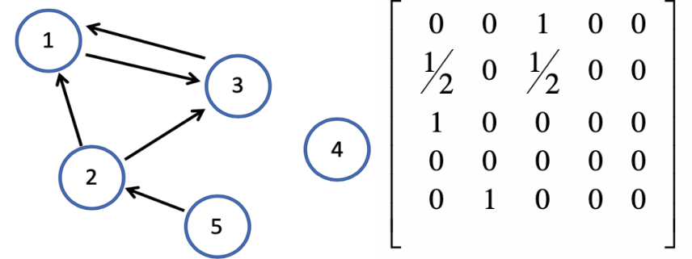
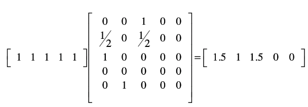
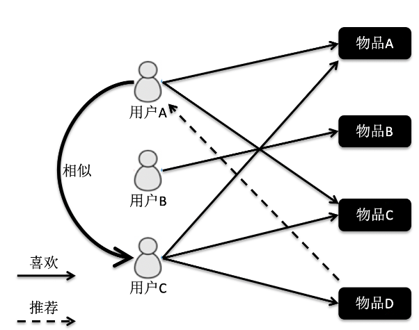
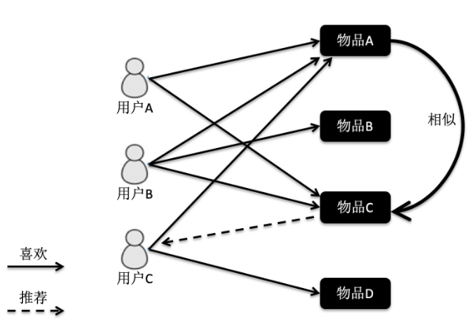
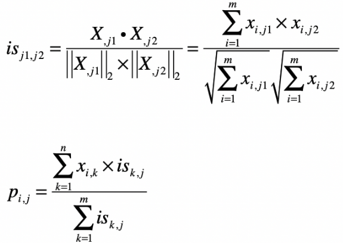

# Matrix

## Page Rank

page rank，即网页得分排名，它的原理是基于马尔科夫链。假设有一个冲浪者模型，他从某章网页出发，根据web图中的链接关系进行网页随机访问。在每个操作步骤中，冲浪者会从当前网页出发，随机选择一个链接作为下一个访问的目标。另外，page rank加入了随机的跳转操作（因为冲浪者的操作是随机的），可以使得冲浪者不是按网页的拓扑结构一层层走下去，只是随机挑选出一张网页进行跳转。

公式如下：

### 简化计算

1. 先计算求和部分，并把最终结果保存为A，因为模型可以简化成：

   在求解A的过程中，L(pj)可以视为归一化之后的邻接矩阵。 

$$
PR(p_i) = \alpha \sum_{p_j \in {M_i}} \frac{PR(p_j)}{L(p_j)} + \frac {1-\alpha}{N} \\ 
= \alpha A + \frac {1-\alpha}{N}
$$

2. 将简化矩阵分解成矩阵的运算
   $$
   PR(p_i) = 
   \left\{
   \begin{matrix}
   A & 1/N
   \end{matrix}
   \right\}
   \left\{
   \begin{matrix}
   \alpha \\
   1-\alpha
   \end{matrix}
   \right\}
   $$

3. 为了避免数字过大溢出，每次计算出新的PR得分，需要进行归一化处理，保证所有结点的数值之和为1.

4. 重复1～3步骤。

### 举例 

[代码见这里](page_rank.py)

1. 初始化PR，网络结点及对应的归一化邻接矩阵。

2. 得到A，计算加入随机操作的PR。

   

3. 归一化PR。

   [0.37027027 0.24864865 0.37027027 0.00540541 0.00540541]

## 协同过滤

图中，行表示不同的用户，列表示不同的物品。试图找到物品间的相似性。从而根据其它用户的喜好，来推荐另一些用户物品。

### 协同过滤公式

####　基于用户

xi1,j: 表示用户xi1对物品j的喜欢程度，得到结果usi1,i2：实际上是利用余弦夹角的关系，获得用户i1和用户i2的向第程度。

第二个公式，usi,k: 表示用户i和k相似程度，xk,j： 同样表示用户k对j物品的喜欢程度，从而退出Pi,j：用户i对物品j的喜欢程度。

#### 基于物品

先求出所有物品j1和j2的相似程度（isj1,j2），同样也获得了isk,j。根据用户i对k物品的喜欢程度xi,j，计算出其对j物品的喜欢程度，从而达到推荐目的。

## 矩阵运算

