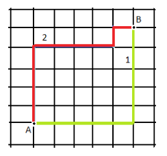

# NLP

## 向量空间

针对向量（x1,x2）和（y1,y2）

- 曼哈顿距离

$$
MD(x,y) = |x_1 - y_1| + |x_2 - y_2| 
\\ = \sum_{i=1}^n |x_i - y_i|
$$

- 欧式距离

解释为向量空间中的真是距离。
$$
ED(x,y) = \sqrt{\sum_{i=1}^n (x_i - y_i)^2}
$$

- 切比雪夫距离

切比雪夫其实是在模拟国际象棋里国王的走法。国王可以走临近 8个格子里的任何一个，那么国王从格子 (x1,x2)(x1,x2)走到格子 (y1,y2)最少的步数。
$$
CD(x,y) = argmax_{i=1}^n |x_i - y_i|
$$

- 闵式距离

相当于对以上三种距离的统筹归纳。

### 范数

衡量某个向量空间中向量的大小和长度。

### 余弦相似性

实际上就是求向量夹角的余弦值，-1 ～1范围内。

