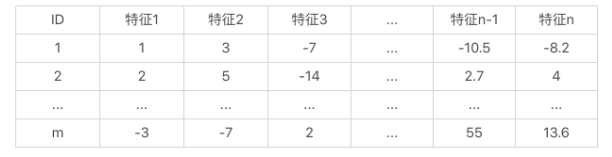
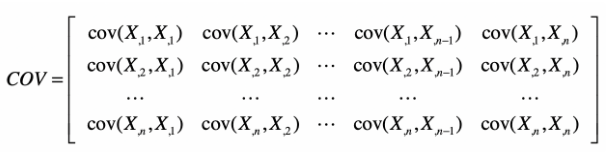
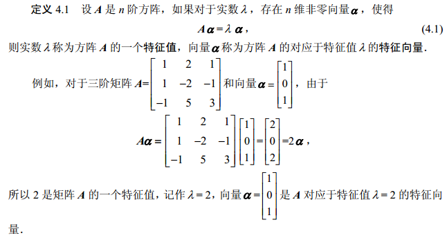
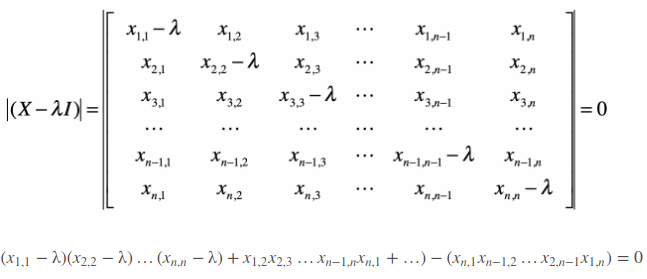

# PCA主成分分析

## 步骤

1. 特征归一化处理，原矩阵为mxn，n为特征数目。
2. 计算特征的列数计算协方差矩阵nxn，其中n为特征列数。
3. 计算协方差矩阵的特征向量，及特征值。
4. 按特征值从大到小排列，选取其中的前k个特征值对应的特征向量，组成新的矩阵mxk。从而实现降维操作。

[代码举例在这里](pca.py)

## 具体实现

### 协方差计算方法

得到nxn的方阵

### 特征矩阵和特征值的计算方法

- 一般情况下：
  $$
  X\alpha = \lambda \alpha \\
  (X - \lambda I) \alpha = 0 \\
  |X - \lambda I| = 0
  $$
  

上述方程是**求解特征多项式： 方阵的特征多项式等于斜边\相乘之和，减去斜边/相乘之和**。

解答上面的方程，则可以求出对应的特征值和特征向量。

## 总结

- 如何确定pca将维后向量k的数目？

一种常见的做法是，看前 k 个特征值的和占所有特征值总和的百分比。假设一共有 10 个特征值，总和是 100，最大的特征值是 最大的特征值是 80，那么第一大特征值占整个特征值之和的 80%。如果需要更多占比，则向后取特征向量。 

- 为什么要用协方差矩阵

  pca的主要目的是降维度。

1. 通常认为当数据在某个维度上的特征差异越大，包含的信息量越多，该特征越重要。特征的差异之和通常用方差衡量。
2. 多个特征可能存在相关性，相关性越高，从某一特征推断另一特征的可能性越高，则其中一个特征就越不重要。而协方差正好可以表示特征之间的相关性。参考：皮尔森（Pearson）相关系数。

- 为什么要计算协方差矩阵的特征值和特征向量？

1. 对角矩阵，指对角线上为非0,其它位置为0的矩阵，相当于把特征全部集中在对角线上。在协方差矩阵中，对角线上的元素表示信息量的方差，其它位置表示协方差的相关性（参考协方差矩阵的计算公式）。对于降低维度pca来说，我们希望极可能保留对角线上的信息。
2. 特征值和特征向量的几何意义：在向量空间中，左乘矩阵相当于对该矩阵进行拉伸或旋转。而求出的特征矩阵，相当于只进行了拉伸（参考特征向量的定义公式），而伸缩的比例就是特征值。如果一个特征值很大，那么说明在对应的特征向量所表示的方向上，伸缩幅度很大。这也是为什么，我们需要使用原始的数据去左乘这个特征向量，来获取降维后的新数据。因为这样做可以帮助我们找到一个方向，让它最大程度地包含原有的信息。需要注意的是，**这个新的方向，往往不代表原始的特征，而是多个原始特征的组合和缩放。**