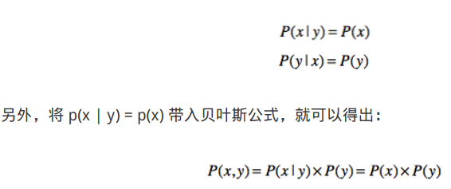

# 概率分布

## 分布类型

### 伯努利分布

单个随机变量分布，只有0和1两种情况。抛硬币则是入为0.5的情况。
$$
P(x=0)=(1-\lambda)\\
P(x=1)=\lambda
$$

### 分类分布

k个不同状态的单个随机变量，当k为2时为伯努利分布。

$$
P(x=k)=\lambda_k
$$

### 正态分布

正态分布(Normal Distribution)，也叫高斯分布(Gaussian Distribution)。

$$
P(x) = \frac{1}{\sqrt{2\pi\sigma^2}}exp(-\frac{(x-\mu)^2}{2\sigma^2})
$$

### 联合概率

由2种及以上因素影响事件的概率，即多个事件同事发生的概率：P(x,y)， 如：90分以上的男生概率

### 条件概率

基于某条件事件x，y事件发生的概率，P(y|x)，如：男生中考90分的概率。

关系：P(x,y) = P(y|x) X P(x)

### 贝叶斯定理

当事件独立时，即x和y的发生是相互独立的，有：

