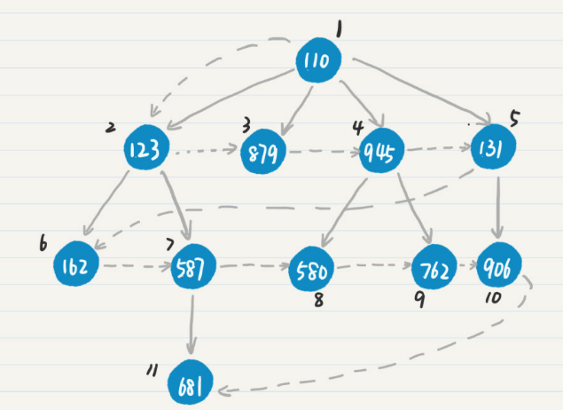

# 广度搜索

## 应用

linkedin的好友推荐：二度好友

## 概念

从图中的某个结点出发，沿着与这个结点相邻的边向前走，寻找与其距离为1的所有其它点。当所有距离为1的结点搜索完毕之后，再搜索距离+1的结点，以此往复，直到全部结点搜索完毕。



## 实现

采用队列queue方式实现BFS。

采用栈stack方式实现DFS。

### linux下读取文件夹方式

参考：https://blog.csdn.net/nuptwanglei/article/details/43051643

```
//linux 读取文件夹方式
#include<dirent.h> 
struct dirent {
long d_ino;                // inode number 索引节点号
off_t d_off;               // offset to this dirent 在目录文件中的偏移
unsigned short d_reclen;   // length of this d_name 文件名长
unsigned char d_type;      // the type of d_name 文件类型 
char d_name[NAME_MAX + 1]; // file name (null-terminated) 文件名，最长255字  符 
}
// d_type 文件类型枚举
enum {
DT_UNKNOWN = 0,
#define DT_UNKNOWN DT_UNKNOWN
DT_FIFO = 1,
#define DT_FIFO DT_FIFO
DT_CHR = 2,
#define DT_CHR DT_CHR
DT_DIR = 4,
// A directory.
#define DT_DIR DT_DIR
DT_BLK = 6,
#define DT_BLK DT_BLK
DT_REG = 8,
// A regular file
#define DT_REG DT_REG
DT_LNK = 10,
// A symbolic link. 
#define DT_LNK DT_LNK
DT_SOCK = 12,
#define DT_SOCK DT_SOCK
DT_WHT = 14
#define DT_WHT DT_WHT
};

// 获得当前目录
char basePath[1000];
memset(basePath, '\0', sizeof(basePath));
getcwd(basePath, 255);
cout << "the current dir is: " << basePath << endl;

// 常规遍历开始
/*
while ((ptr = readdir(dir)) != NULL) {
// 忽略隐藏文件和路径: .and..
if (regex_match(ptr->d_name, regex("\\.(.*)"))) {
continue;
}

if (ptr->d_type == 8) {
// A regular file
//cout << "file: " << basePath << "/" << ptr->d_name << endl;
cout << "file: " << ptr->d_name << endl;
} else if (ptr->d_type == 4) {
memset(base, '\0', sizeof(base));
// A directory
strcpy(base, basePath);
strcat(base, "/");
strcat(base, ptr->d_name);
// 继续搜索下一个目录
DfsFile(base);
}
}*/

```

### C++正则表达式

参考：http://blog.topspeedsnail.com/archives/6810

### 案例

采用DFS和BFS遍历ubuntu指定目录下的所有文件。

DFS和BFS的变换通过更改stack和queue。

[代码实现](tree_breadth_first_search.cpp)

```shell
# 输出结果：
Current path: /home/joe/Desktop/leetcode
leetcodePractice.cpp
a.out
README.md
Current path: /home/joe/Desktop/leetcode/unfinished
merge_sort.cpp
```

