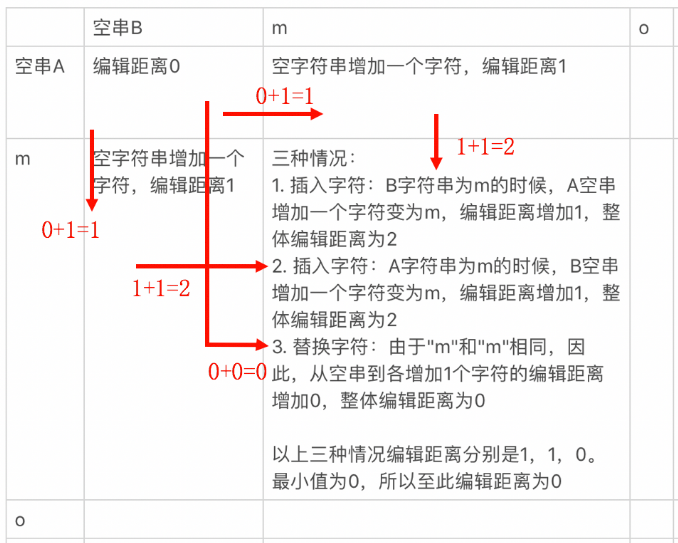
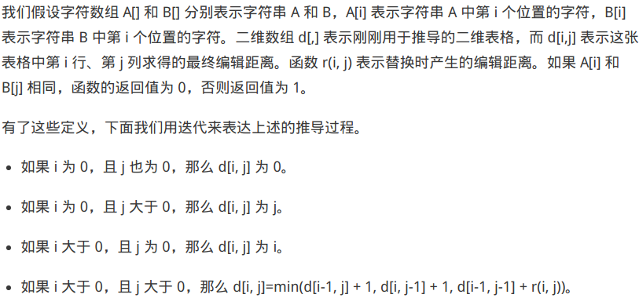
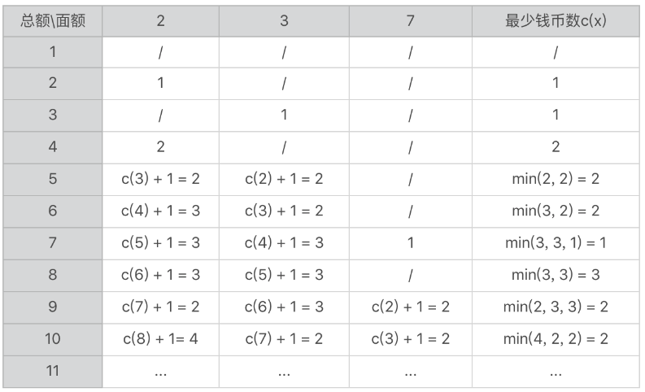

# 动态规划

关键：通过递归，找到子问题的最优解，从而推到最终问题的最优解。

状态转移：子问题之间的转移。

动态规划虽然也采用了把问题逐步简化的思想，但是它和基于递归的递归的归并排序、排列组合等解法有所不同。能够使用动态规划解决通常只关心一个最优解，而这个最优解是单调改变的，例如最大值、最小值等等。

动态规划中的每种状态，通常只保留一个当前的最优解，这也是动态规划比较高效的原因。

## 编辑距离

由一个字符串转化成另一个字符串的最小编辑操作的次数，用于查询搜索。

编辑操作方式：替换字符，插入字符，删除字符。

其它字符串相似性评价指标：余弦相似性，欧式距离等。

### 举例

- ->mouse编辑距离为1.

- 字符串A转化成B，编辑距离情况：

  从B到A是逆操作，编辑距离相等。

  

## 状态转移方程

- 注释

d[i-1, j]+1：A->B，采用插入方式，编辑距离＋１
d[i, j-1]+1：B->A，采用插入方式，编辑距离＋１
d[i-1, j-1]+r[i, j]：A->B，采用替换方式，若Ａ[i]==B[j], 替换编辑距离为０，否则为１．

### 实例

若存在2，3， 7元三种纸币，为凑出一定总额，如何方式需要的纸币数量最少？

状态转移方程：
$$
c[i] = arg_1^j min(c[i-value(j)]+1)
$$
c[i]: 表示金额为i时候的最少纸币数量

arg：表示遍历纸币种类，value(j)：表示对应的纸币种类的面值。在本题目中value(0) = 2，value(1)  = 3. i- value(j) 不小于0。

c[0] = 0

- [C++代码实现](dynamic_programming.cpp)

