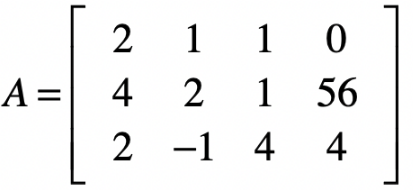
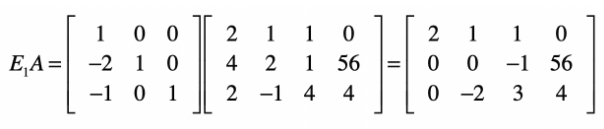
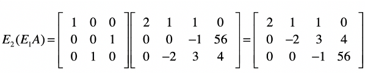

# 线性回归

## 高斯消元法解线性方程的解

在低元线性回归方程中，可以得到精确解。但对高元线性方程中，计算复杂，且不一定存在最终解。

主要根据求解多元方程解的思路：消元+回归。用矩阵解决如下：

### 消元

### 回归

相当于将得到的x回调，进而求出不同的x。

$$
\left\{
\begin{matrix}
-9/4 & 5/4 & 1/4\\
7/2 & -3/2 & -1/2 \\
2 & -1 & 0
\end{matrix}
\right\}
*
\left\{
\begin{matrix}
1 & 0 & 0 & 71\\
0 & 1 & 0 & -86 \\
0 & 0 & 1 & -56
\end{matrix}
\right\}
= 
\left\{
\begin{matrix}
2 & 1 & 1 & 0 \\
0 & -2 & 3 & 4 \\
0 & 0 & -1 & 56
\end{matrix}
\right\}
$$
左侧的为原矩阵的逆矩阵。

左侧第二部分中：左边为单元矩阵，右半部分对应为原方程的解。

## 最小二乘法

$$
y_{pred} = a_0 + a_1*x_1 + a_2*x_2 + ...+ a_n*x_n\\
\epsilon = y - y_{pred}
$$

最小二乘法的核心思想是，残差最小，即平方范数最小。
$$
min(||XA-Y||_2^2)
$$
**具体推导方式:**

最终可以推到出：
$$
A = (X'X)^{-1}X'Y
$$
通常情况下，我们会考虑有截距的存在，及a0存在，那么X的第一列为1。

X'X得到的是方针，因此逆矩阵一定存在。重点是求取逆矩阵的方法。