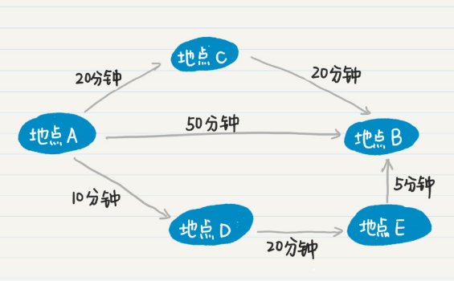
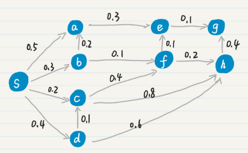
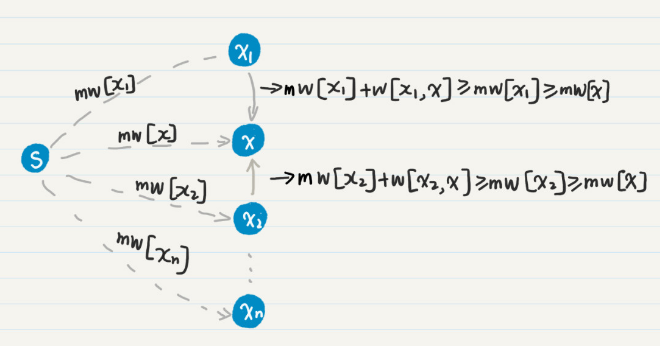

# 图

广度优先搜索算法可以判断路的通路，图需要在上面加入权重概念。

A-B三条路，但是用时（权重）不一样。



## Dijkstra算法-单源最短路径算法

思想：指定某一节点，求到指定结点的最短路径。对于某个结点，如果发现了最优的通路，则在后续的步骤无需考虑该结点。--类似于动态规划。

- source：起点，s

- weight：任意边的权重，二维数组，w[m,n]：m-n有向边的权重。如存在多个权重，取最小值。不能直接到达的边，权重为无穷大。

- min_weight：source到任意结点的最小权重，一维数组。mw[s] = 0;

- finish：已经找到最小权重的结点之集合。一旦结点放入集合F，这个结点在将不参加未来的计算。

### 步骤

1. 查找最小的mw，并将对应结点加入Finish。

2. 更新权重
  

  

### 示例



其中mw[x]为最小值。



推导过程：

 


### 算法实现

PseudoCode

```pseudocode
function Dijkstra(Graph, source):
  create vertex set F
  // init
  for each vertex v in Graph:
    if unknow distance:
      dist[v]:inf
    else：
      dist[v]:distance
   dist[source]:0
   F.add(source)
   
   while F.size() < vertex num:
     
```


