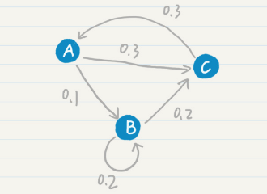
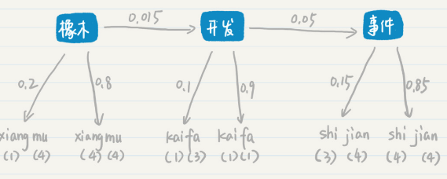

# Markov Chain

## Rule of Chain 链式法则

推导方式：

## Hypothesis of Markov 马尔科夫假设

多元文法(Ngram)：任何一个词wi，只与其前1个或多个词相关，对应与N的数目。即任意一个词出现的概率，只与其N-1个词有关。

举例：

二元文法（Ngram，N=2）：某单词出现的概率，只与其前一个词有关。
$$
P(w_n|w_1w_2...w_{n-1}) =P(w_n|w_{n-1})
$$
一元文法（Ngram，N=1）：

表示每个词都是相互独立的，不与前面任何词有关。
$$
P(w_n|w_1w_2...w_{n-1}) =P(w_1)*P(w_2)*...*P(w_n)
$$

## 简化计算

利用马尔科夫假设可以简化链式法则：

如利用三元文法：
$$
P(w_1w_2...w_n)=P(w_1)*P(w_2|w_1)*...*P(w_{n-1}|w_1w_2...w_{n-2})*P(w_n|w_1w_2...w_{n-1})
\\
=P(w_1)*P(w_2|w_1)*...*P(w_{n-1}|w_{n-3}w_{n-2})*P(w_n|w_{n-2}w_{n-1})
$$

## 应用

在NLP中计算某句子出现的概率：

P(w3|w1,w2,D)表示文档D中出现w1和w2句子中出现w3的概率，不是说w1和w2词语中包含w3的概率，后者概率显然为0。

## 马尔科夫模型

马尔科夫假设，也相当于说：每个词按照一定的概率转移到下一个词。

N元文法对应N-1阶马尔科夫模型。

若将ABC对应于我 去 学校，则有，词之间的概率为马尔科夫假设中的**转移概率。**

## 隐马尔科夫模型

隐藏状态层x，输出状态层y。

输出概率为：
$$
P = P(x1)*P(y1|x1)*P(x2|x1)*P(y2|x2)*P(x3|x2)*P(y3|x3)\\
= P(x1)*b11*a12*b22*a23*b33
$$

### 应用

根据拼音：xiang(四声)mu(四声)    kai(一声)fa(一声)    shi(四声)jian(四声)，判断对应语料库中的句子？

- 假设第一种情况

  
  $$
  P = P(项目)*P(y1|项目)*P(开发|项目)*P(y2|开发)*P(时间|开发)*P(y3|x3)\\
  = P(项目)*0.8*0.25*0.9*0.3*0.05 = P(项目)*0.0027
  $$

- 假设第二种情况

  
  $$
  P = P(橡木)*P(y1|)*P(开发|橡木)*P(y2|开发)*P(事件|开发)*P(y3|x3)\\
  = P(橡木)*0.8*0.015*0.9*0.05*0.85 = P(橡木)*0.000459
  $$
  

- 小结

  在P(橡木)==P(项目)的情况下，第二种情况的概率低。具体确定拼音对应的词语，需要比对所有的语料库。

  隐马尔科夫模型在语音中的应用，流程是：
  1，根据拼音去找到单个对应的词语，不考虑声调的概率。
  2，再根据词语之间转移的概率，词语对应目标音高的概率，进而求出整个句子输出的概率。概率越大，可能性越高。
  因此第一个词可以是xiangmu 对应语料库的所有词，不一定是四声，可以是香木之类的词语。
