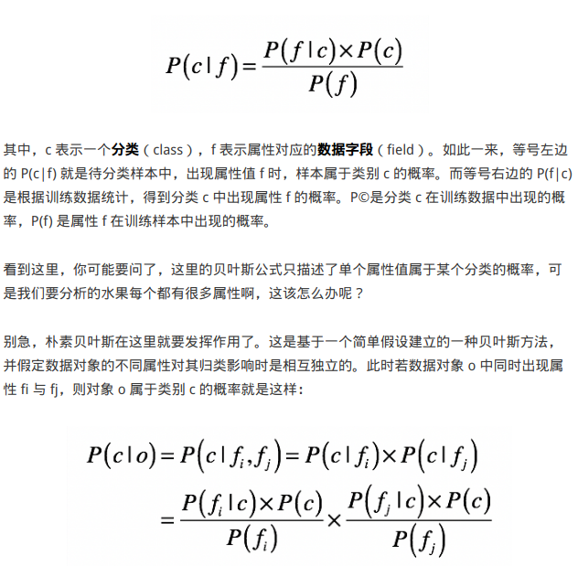
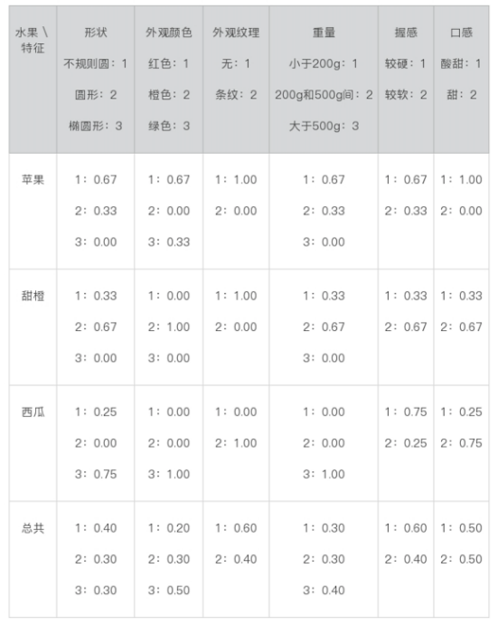
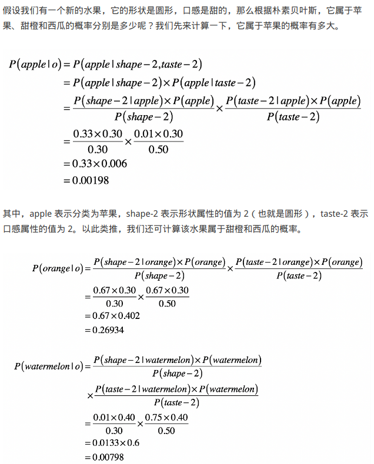
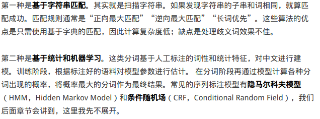
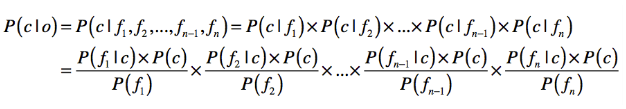

# 朴素贝叶斯

## 公式

## 分析步骤

### 用朴素贝叶斯进行水果分类

1. 准备数据。针对数据的特征，将其转化成计算机可以理解的数据。如水果的特征转化成数字，数据称为训练样本。

   

2. 建立模型。计算特征的先验概率，以及在特殊条件下对应特征的条件概率。该过程为基于样本的训练。

   

3. 分类新数据。基于朴素贝叶斯理论，对预测对象进行预测。

   在下面的案例中，该特征水果的属于西瓜的概率最大。

   **特殊情况：条件概率为0的情况可以用很小的数字代替，避免因为0而印象到整体的概率，起平滑处理作用。**

   

   

### 用朴素贝叶斯进行文本分类

#### 关键步骤：基于自然语言的预处理

#### 分词

英文主要按空格划分。

中文可采用基于字符串匹配、基于统计和机器学习。

#### 取词干和归一化

主要针对英文，去除英文词时态变形的干扰。

将 am，is，are，was，were 全部转换为 be
将 car，cars，car’s，cars’全部转换为 car

#### 停用词 stop word

停止词基本上没有意义，如：a，the，的，个。根据停用词字典，去除相应的停止词。

#### 同义词和扩展词

番茄，西红柿
菠萝，凤梨
洋山芋，土豆
泡面，方便面，速食面，快餐面
山芋，红薯
鼠标，滑鼠

........

#### 运用朴素贝叶斯计算

同水果分类的计算方式：

