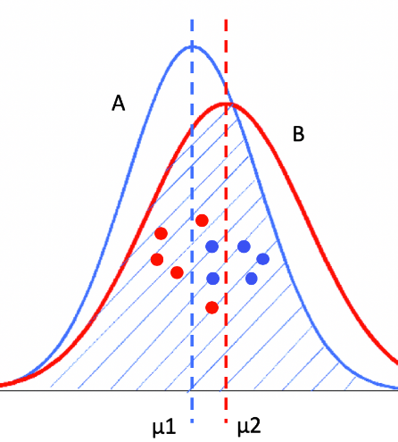

# 测试与检验

## A/B test

A/B 测试，简单来说，就是为同一个目标制定两个方案（比如两个页面），让一部分用户使用 A 方案，另一部分用户使用 B 方案，记录下用户的使用情况，看哪个方案更符合设计，通常为转化率较高的一方。

缺陷：对A/B方案采样得到的数据，可能是局部的数据，不一定能有效反映整体的均值，很可能出现错误的结论。

上图，整体看来B的均值要高于A，但如果采样B只采集了红色的点，A采集的是蓝色的点，会可能错误估计B的均值低于A的结论。

## 统计假设检验和显著性检验

统计假设检验是指事先对随机变量的参数或总体分布做出一个假设，然后利用样本信息来判断这个假设是否合理。在统计学上，我们称这种假设为虚无假设（Null Hypothesis），也叫原假设或零假设，通常记作H0。而和虚无假设对立的假设，我们称为对立假设（Alternative Hypothesis），通常记作H1。也就是说，如果证明虚无假设不成立，那么就可以推出对立假设成立。

- 差异是否显著，关键看引起差异是否为偶然性引起的。

## 方差分析

Analysis of Variance，也叫F检验。可以检验两组或者多组样本的均值是否具备显著性差异。

需要满足假设：

- 样本随机采样。

- 不同组样本相互独立。

- 组内样本来自同一个正太分布。

- 不同组方差相等或相近。

#### 因变量方差 Total sum of squares

$$
SS_T = \sum\sum(Y_{ij}-Y_{total-mean})
$$

### 模型平方和 sum of Square for model

$$
SS_M = \sum n_j(Y_{j-model-mean}-Y_{total-mean})
$$

### 误差平方和 sum of squares for error

$$
SS_E = \sum\sum(Y_{ij}-Y_{j-model-mean})
$$

$$
SS_T = SS_M + SS_E\\
F = \frac{SS_M/(s-1)}{SS_E/(n-s)}
$$

其中：s是水平的个数，n是所有样本的总数，s-1为分布的自由度，n-s为误差的自由度。

通过对比计算的F值和“F检验临界值表”的F值，如果前者小于后者，说明不具备显著性差异，反之则具备显著性差异。

## 拟合分析

###　处理办法

#### 欠拟合

1. 主要是由于特征维度过少，拟合的模型不够复杂，无法满足训练样本，导致误差较大。
2. 适当增大特征维度，增加模型的复杂度。如增加N-gram的N。

#### 过拟合
1. 过拟合与欠拟合相反，主要是特征维度太多，导致拟合的模型过于完美的符合训练样本，无法满足测试样本或新的数据。
2. 适当减小特征维度，减小模型的复杂度。
3. 可以采用剪枝或随机森林来处理。
4. 可以采用增加样本训练数据，但要尽可能保持训练数据和测试数据分布的一致性。主要采用交叉验证的方式(cross validation)。

HINT： 随机森林有很多决策树针对同一套训练样本。算法采用的是可重复采样法，每次从全部样本n中挑选出m个样本，组成决策树。根据不同的决策树的判断结果，选择大多数树的意见。因为这种随机性的处理，导致每个决策树的过拟合程度都会降低。

